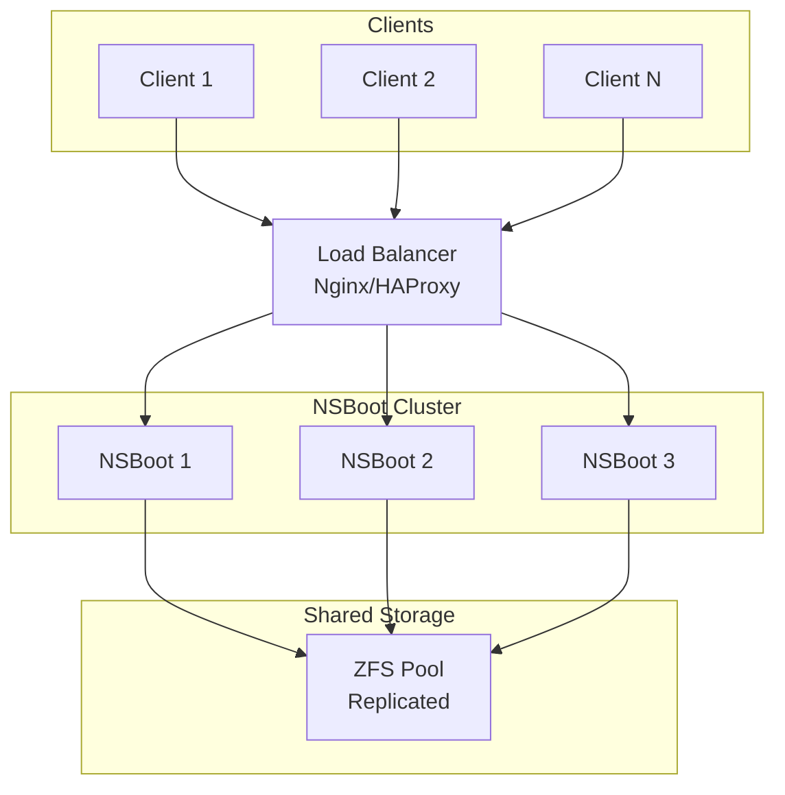

# Load Balancing Configuration

Guide for setting up load balancing across multiple NSBoot servers.

## Overview

Load balancing distributes client boot requests across multiple NSBoot servers for:
- **High availability** - No single point of failure
- **Scalability** - Handle 1000+ concurrent boots
- **Performance** - Distribute load evenly

## Architecture



## Nginx Load Balancing

### Configuration

Use the provided configuration:

```bash
# Copy load balancing config
cp nginx/load-balancing.conf /etc/nginx/sites-available/nsboot-lb

# Enable site
ln -s /etc/nginx/sites-available/nsboot-lb /etc/nginx/sites-enabled/

# Test configuration
nginx -t

# Reload
systemctl reload nginx
```

### Load Balancing Methods

**1. Round Robin (Default)**
```nginx
upstream nsboot_backend {
    server nsboot-1:80;
    server nsboot-2:80;
    server nsboot-3:80;
}
```

**2. Least Connections (Recommended)**
```nginx
upstream nsboot_backend {
    least_conn;
    server nsboot-1:80;
    server nsboot-2:80;
    server nsboot-3:80;
}
```

**3. IP Hash (Sticky Sessions)**
```nginx
upstream nsboot_backend {
    ip_hash;
    server nsboot-1:80;
    server nsboot-2:80;
    server nsboot-3:80;
}
```

**4. Weighted**
```nginx
upstream nsboot_backend {
    server nsboot-1:80 weight=3;  # More powerful
    server nsboot-2:80 weight=2;
    server nsboot-3:80 weight=1;
}
```

### Health Checks

```nginx
upstream nsboot_backend {
    server nsboot-1:80 max_fails=3 fail_timeout=30s;
    server nsboot-2:80 max_fails=3 fail_timeout=30s;
    server nsboot-3:80 max_fails=3 fail_timeout=30s;
    
    # Active health check (requires nginx-plus or module)
    check interval=3000 rise=2 fall=3 timeout=1000 type=http;
    check_http_send "GET /health HTTP/1.0\r\n\r\n";
    check_http_expect_alive http_2xx http_3xx;
}
```

## HAProxy Load Balancing

### Configuration

```haproxy
global
    log /dev/log local0
    maxconn 4096
    user haproxy
    group haproxy
    daemon

defaults
    log global
    mode http
    option httplog
    option dontlognull
    timeout connect 5000
    timeout client 50000
    timeout server 50000

frontend nsboot_frontend
    bind *:80
    default_backend nsboot_backend
    
    # ACLs
    acl is_websocket hdr(Upgrade) -i WebSocket
    acl is_api path_beg /api/
    
    # Use backend
    use_backend nsboot_websocket if is_websocket
    use_backend nsboot_backend if is_api
    default_backend nsboot_backend

backend nsboot_backend
    balance leastconn
    option httpchk GET /health
    
    server nsboot-1 192.168.1.101:80 check inter 3s rise 2 fall 3
    server nsboot-2 192.168.1.102:80 check inter 3s rise 2 fall 3
    server nsboot-3 192.168.1.103:80 check inter 3s rise 2 fall 3

backend nsboot_websocket
    balance source  # Sticky sessions for WebSocket
    option httpchk GET /health
    
    server nsboot-1 192.168.1.101:80 check inter 3s
    server nsboot-2 192.168.1.102:80 check inter 3s
    server nsboot-3 192.168.1.103:80 check inter 3s
```

## Kubernetes Load Balancing

### Service Configuration

```yaml
apiVersion: v1
kind: Service
metadata:
  name: nsboot
  namespace: nsboot
spec:
  type: LoadBalancer
  sessionAffinity: ClientIP  # Sticky sessions
  sessionAffinityConfig:
    clientIP:
      timeoutSeconds: 3600
  ports:
  - name: http
    port: 80
    targetPort: 80
  selector:
    app: nsboot
```

### Ingress with Load Balancing

```yaml
apiVersion: networking.k8s.io/v1
kind: Ingress
metadata:
  name: nsboot
  annotations:
    nginx.ingress.kubernetes.io/affinity: "cookie"
    nginx.ingress.kubernetes.io/session-cookie-name: "nsboot-session"
    nginx.ingress.kubernetes.io/session-cookie-expires: "3600"
    nginx.ingress.kubernetes.io/session-cookie-max-age: "3600"
spec:
  ingressClassName: nginx
  rules:
  - host: nsboot.example.com
    http:
      paths:
      - path: /
        pathType: Prefix
        backend:
          service:
            name: nsboot
            port:
              number: 80
```

## Session Persistence

### Cookie-based (Recommended)

```nginx
upstream nsboot_backend {
    server nsboot-1:80;
    server nsboot-2:80;
    server nsboot-3:80;
    
    sticky cookie nsboot-session expires=1h domain=.example.com path=/;
}
```

### IP-based

```nginx
upstream nsboot_backend {
    ip_hash;
    server nsboot-1:80;
    server nsboot-2:80;
    server nsboot-3:80;
}
```

## Shared Storage

All NSBoot instances must access the same ZFS pool:

### Option 1: NFS Export

```bash
# On primary server
zfs set sharenfs=on nsboot0/images

# On secondary servers
mount -t nfs primary-server:/nsboot0/images /srv/images
```

### Option 2: ZFS Replication

```bash
# Continuous replication
zfs send -R nsboot0/images@latest | ssh nsboot-2 zfs receive -F nsboot0/images
```

### Option 3: Shared SAN

- Use iSCSI or FC SAN
- All servers access same storage
- Requires cluster filesystem (GFS2, OCFS2)

## Monitoring Load Balancer

### Nginx Stats

```nginx
location /nginx_status {
    stub_status on;
    access_log off;
    allow 127.0.0.1;
    deny all;
}
```

### HAProxy Stats

```haproxy
listen stats
    bind *:8404
    stats enable
    stats uri /stats
    stats refresh 30s
    stats admin if TRUE
```

### Prometheus Metrics

```yaml
# Scrape load balancer metrics
scrape_configs:
  - job_name: 'nginx-lb'
    static_configs:
      - targets: ['lb-server:9113']
```

## Testing Load Balancing

```bash
# Test round-robin
for i in {1..10}; do
  curl -s http://nsboot.example.com/api/system/info | jq -r '.hostname'
done

# Test with session
curl -c cookies.txt http://nsboot.example.com/api/auth/login
for i in {1..10}; do
  curl -b cookies.txt http://nsboot.example.com/api/system/info | jq -r '.hostname'
done
```

## Troubleshooting

### Uneven Load Distribution

**Check:**
- Load balancing algorithm
- Server weights
- Health check status

**Fix:**
```nginx
# Use least_conn instead of round_robin
upstream nsboot_backend {
    least_conn;
    server nsboot-1:80;
    server nsboot-2:80;
}
```

### Session Loss

**Check:**
- Session persistence configuration
- Cookie settings
- WebSocket sticky sessions

**Fix:**
```nginx
# Enable sticky sessions
sticky cookie nsboot-session expires=1h;
```

### Backend Server Down

**Check:**
```bash
# Nginx
nginx -t
systemctl status nginx

# Check upstream
curl http://nsboot-1/health
```

**Fix:**
- Automatic with health checks
- Failed servers removed from pool
- Restored when healthy

## Best Practices

1. **Use Health Checks** - Automatic failover
2. **Sticky Sessions** - For WebSocket and auth
3. **Connection Pooling** - Reduce overhead
4. **Monitoring** - Track backend health
5. **Graceful Shutdown** - Drain connections
6. **SSL Termination** - At load balancer
7. **Rate Limiting** - Protect backends
8. **Caching** - Reduce backend load

## Performance Tuning

```nginx
# Increase worker connections
worker_processes auto;
worker_connections 4096;

# Keepalive to backends
upstream nsboot_backend {
    server nsboot-1:80;
    server nsboot-2:80;
    keepalive 32;
    keepalive_timeout 60s;
}

# Enable caching
proxy_cache_path /var/cache/nginx levels=1:2 keys_zone=nsboot:10m;
proxy_cache nsboot;
```

## Next Steps

- [High Availability](high-availability.md)
- [Performance Tuning](performance.md)
- [Monitoring](../user-guide/monitoring.md)
