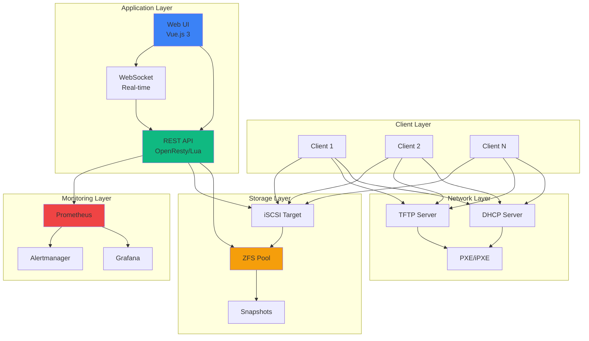
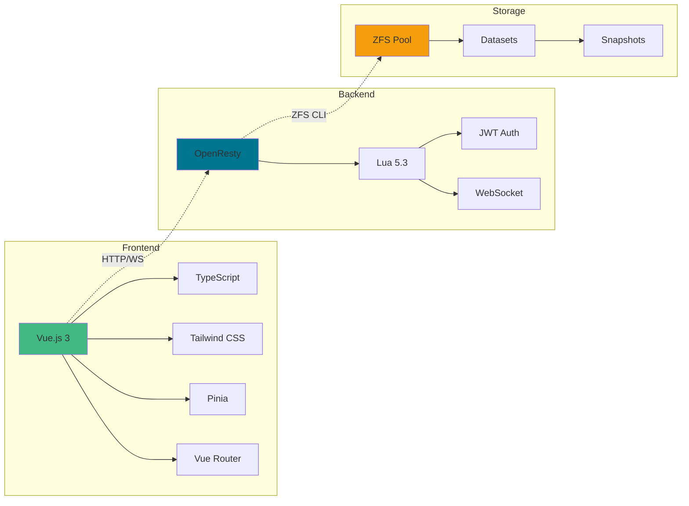
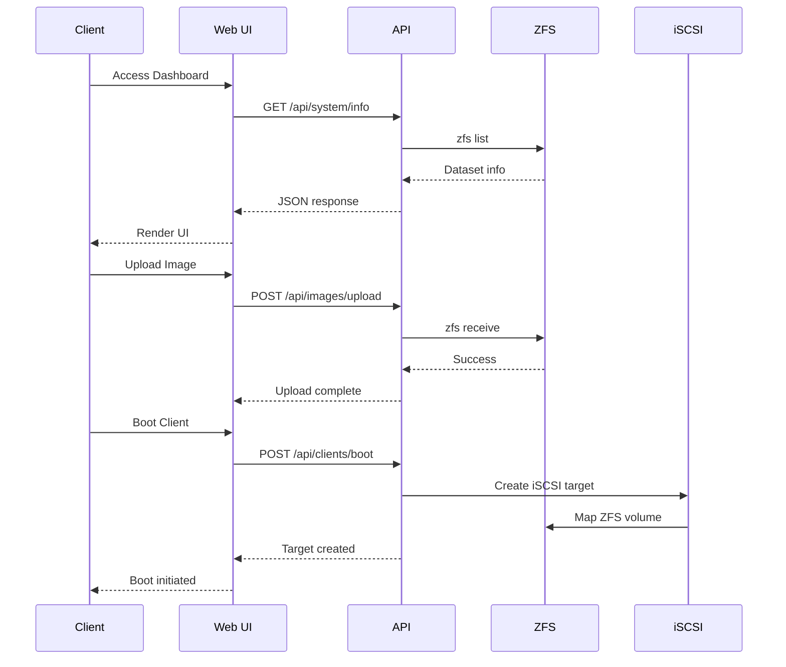
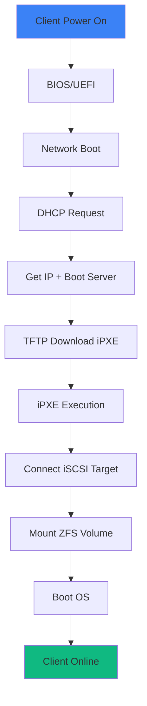
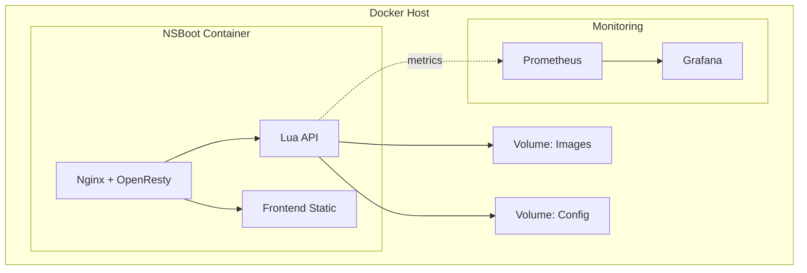
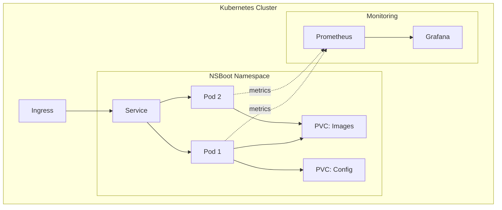
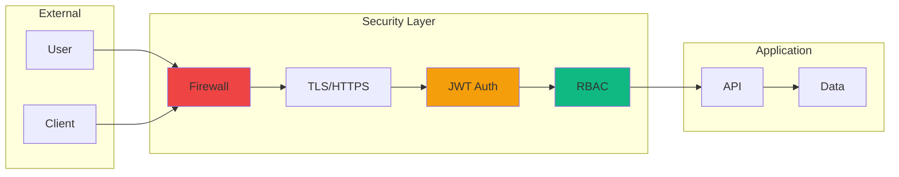
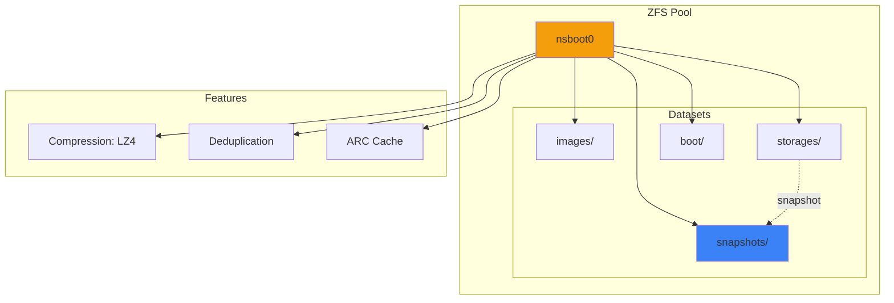
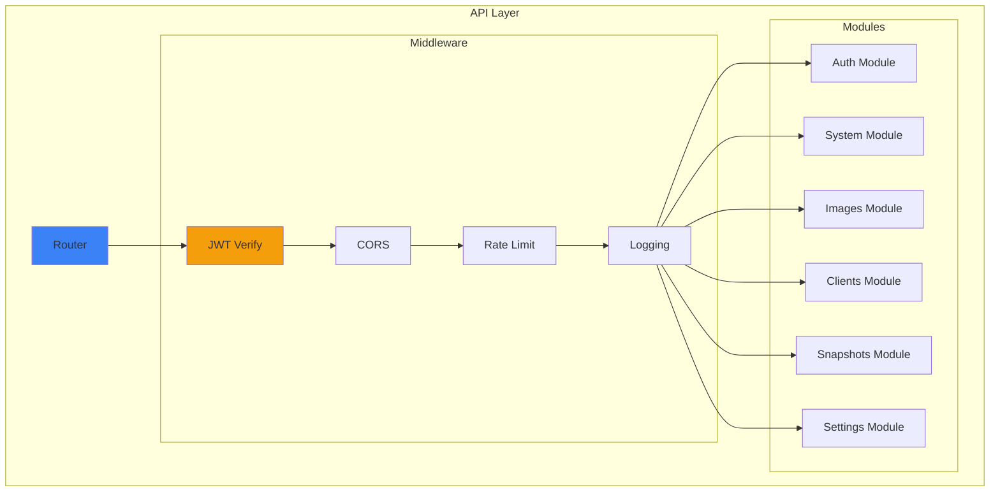
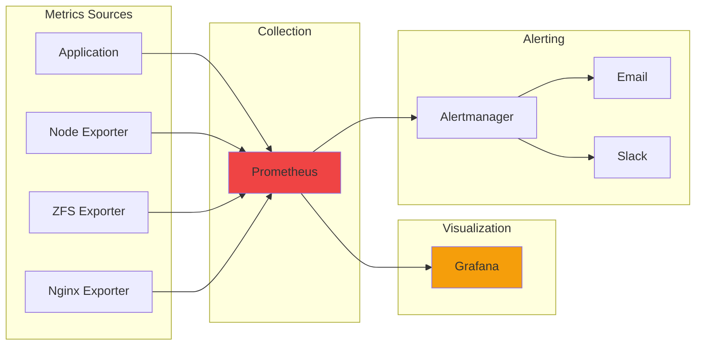

# Architecture Overview

NSBoot follows a modern, layered architecture designed for scalability and maintainability.

## High-Level Architecture

## Component Architecture

## Data Flow

## Boot Process Flow

## Deployment Architecture

### Docker Deployment

### Kubernetes Deployment

## Security Architecture

## Storage Architecture

## API Architecture

## Monitoring Architecture

## Technology Stack

### Frontend
- **Framework**: Vue.js 3.4 (Composition API)
- **Language**: TypeScript 5.4
- **Styling**: Tailwind CSS 3.4
- **State**: Pinia 2.1
- **Router**: Vue Router 4.x
- **Charts**: Chart.js 4.4
- **Build**: Vite 5.1

### Backend
- **Server**: OpenResty (Nginx + LuaJIT)
- **Language**: Lua 5.3
- **JSON**: lua-cjson
- **HTTP**: lua-resty-http
- **JWT**: lua-resty-jwt
- **WebSocket**: lua-resty-websocket

### Storage
- **Filesystem**: ZFS 2.1+
- **Block Storage**: iSCSI (tgt), NBD
- **Compression**: LZ4, GZIP, ZSTD
- **Snapshots**: ZFS native

### Network
- **Boot**: PXE, iPXE, UEFI
- **DHCP**: isc-dhcp-server
- **TFTP**: tftpd-hpa
- **Protocol**: iSCSI, NBD

### Monitoring
- **Metrics**: Prometheus 2.x
- **Visualization**: Grafana 10.x
- **Alerting**: Alertmanager
- **Exporters**: Node, ZFS, Nginx

### DevOps
- **Container**: Docker 24.0+
- **Orchestration**: Kubernetes 1.24+
- **Package**: Helm 3.0+
- **CI/CD**: GitHub Actions

## Design Principles

### 1. Separation of Concerns
- Frontend handles UI/UX
- Backend handles business logic
- Storage handles data persistence

### 2. API-First Design
- RESTful API for all operations
- WebSocket for real-time updates
- OpenAPI documentation

### 3. Scalability
- Horizontal scaling via Kubernetes
- Stateless API design
- Distributed storage with ZFS

### 4. Security
- JWT authentication
- HTTPS/TLS encryption
- Role-based access control
- Security headers

### 5. Observability
- Prometheus metrics
- Structured logging
- Distributed tracing (future)
- Health checks

### 6. Developer Experience
- TypeScript for type safety
- Hot reload in development
- Comprehensive documentation
- Easy local setup

## Performance Characteristics

### Latency
- API response: <100ms (p95)
- Page load: <2s
- WebSocket latency: <50ms
- Boot time: <30s per client

### Throughput
- API requests: 1000 req/s
- Concurrent boots: 100 clients
- ZFS IOPS: >10,000
- Network: 10 Gbps

### Scalability
- Clients: 1000+ per server
- Images: Unlimited (storage limited)
- Concurrent users: 100+
- Kubernetes pods: Auto-scale

## Next Steps

- [Component Details](components.md)
- [Data Models](data-models.md)
- [API Design](../api/overview.md)
- [Deployment](../deployment/)
