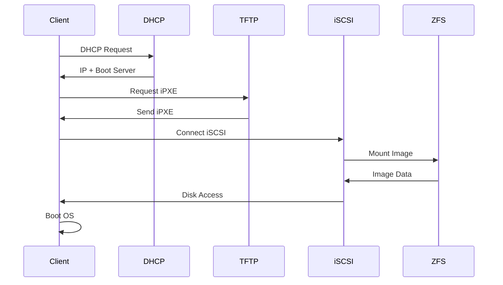

# Quick Start Guide

Get NSBoot up and running in 15 minutes!

## Step 1: Start NSBoot

=== "Docker"
    ```bash
    docker compose up -d
    ```

=== "Bare Metal"
    ```bash
    sudo systemctl start nsbootd
    sudo systemctl start nginx
    sudo systemctl start isc-dhcp-server
    ```

## Step 2: Access Web Interface

Open your browser and navigate to:
```
http://<server-ip>
```

You should see the NSBoot dashboard.

## Step 3: Upload an OS Image

### Prepare Your Image

NSBoot supports multiple image formats:
- **ISO**: Direct boot from ISO files
- **VHD/VHDX**: Windows virtual hard disks
- **QCOW2**: QEMU disk images
- **VMDK**: VMware disk images

### Upload via Web UI

1. Click **Images** in the navigation menu
2. Click **Upload Image** button
3. Select your image file
4. Choose the image type
5. Click **Upload**

### Upload via CLI

```bash
# Copy image to storage directory
sudo cp /path/to/windows10.vhdx /srv/images/storages/

# Set permissions
sudo chown www-data:www-data /srv/images/storages/windows10.vhdx
```

## Step 4: Create a Client Configuration

### Via Web UI

1. Click **Clients** in the navigation menu
2. Click **Add Client** button
3. Fill in the details:
   - **Hostname**: `workstation-01`
   - **MAC Address**: `00:11:22:33:44:55`
   - **IP Address**: `192.168.1.150`
   - **Image**: Select your uploaded image
4. Click **Save**

### Via Configuration File

Edit `/srv/nsboot/cfg/nsboot.json`:

```json
{
  "clients": [
    {
      "hostname": "workstation-01",
      "mac_address": "00:11:22:33:44:55",
      "ip_address": "192.168.1.150",
      "target_id": 1,
      "image": "windows10.vhdx",
      "enabled": true
    }
  ]
}
```

## Step 5: Configure Client Machine

### BIOS/UEFI Settings

On your client workstation:

1. Enter BIOS/UEFI setup (usually F2, F12, or Del during boot)
2. Enable **Network Boot** or **PXE Boot**
3. Set boot order: Network boot first
4. Save and exit

### Boot the Client

1. Power on the client machine
2. It should receive an IP from DHCP
3. Download iPXE bootloader via TFTP
4. Connect to iSCSI target
5. Boot the OS image

## Step 6: Verify Boot

Watch the client boot process:



## Step 7: Create a Snapshot (Optional)

After the client boots successfully, create a snapshot for backup:

### Via Web UI

1. Go to **Snapshots**
2. Click **Create Snapshot**
3. Select the image
4. Enter snapshot name: `clean-install`
5. Click **Create**

### Via CLI

```bash
sudo zfs snapshot nsboot0/images/storages/windows10.vhdx@clean-install
```

## Common Boot Scenarios

### Scenario 1: Windows 10/11 Diskless Boot

```bash
# 1. Create a VHD/VHDX image
qemu-img create -f vhdx /srv/images/storages/win10.vhdx 60G

# 2. Install Windows to the image (use another machine or VM)
# 3. Upload to NSBoot
# 4. Configure client to boot from this image
```

### Scenario 2: Linux Diskless Boot

```bash
# 1. Create QCOW2 image
qemu-img create -f qcow2 /srv/images/storages/ubuntu.qcow2 40G

# 2. Install Ubuntu to the image
# 3. Configure for network boot
# 4. Upload to NSBoot
```

### Scenario 3: Multi-Boot Setup

Configure a client to boot from multiple images:

```json
{
  "hostname": "workstation-01",
  "boot_options": [
    {
      "name": "Windows 10",
      "image": "windows10.vhdx",
      "default": true
    },
    {
      "name": "Ubuntu 22.04",
      "image": "ubuntu.qcow2"
    },
    {
      "name": "Windows 11 Gaming",
      "image": "win11-gaming.vhdx"
    }
  ]
}
```

## Testing & Validation

### Check Client Connection

```bash
# View active iSCSI sessions
sudo tgtadm --lld iscsi --op show --mode target

# Check ZFS I/O statistics
sudo zpool iostat -v nsboot0 1
```

### Monitor Performance

Access the monitoring dashboard:
```
http://<server-ip>/monitoring
```

Or Grafana:
```
http://<server-ip>:3000
```

## Next Steps

Now that you have NSBoot running:

- [Configure advanced settings](configuration.md)
- [Set up monitoring](../user-guide/monitoring.md)
- [Optimize performance](../admin/performance.md)
- [Configure security](../admin/security.md)

## Troubleshooting

### Client doesn't boot

1. Check DHCP is running: `sudo systemctl status isc-dhcp-server`
2. Check TFTP is accessible: `tftp <server-ip> -c get ipxe.efi`
3. Check iSCSI target: `sudo tgtadm --lld iscsi --op show --mode target`

### Slow boot times

1. Check network speed (should be Gigabit)
2. Verify ZFS ARC cache: `arc_summary`
3. Consider adding L2ARC cache device

### Image not found

1. Verify image exists: `ls -lh /srv/images/storages/`
2. Check permissions: `sudo chown www-data:www-data /srv/images/storages/*`
3. Check ZFS mount: `zfs list`

For more help, see [Troubleshooting Guide](../troubleshooting/common-issues.md).
