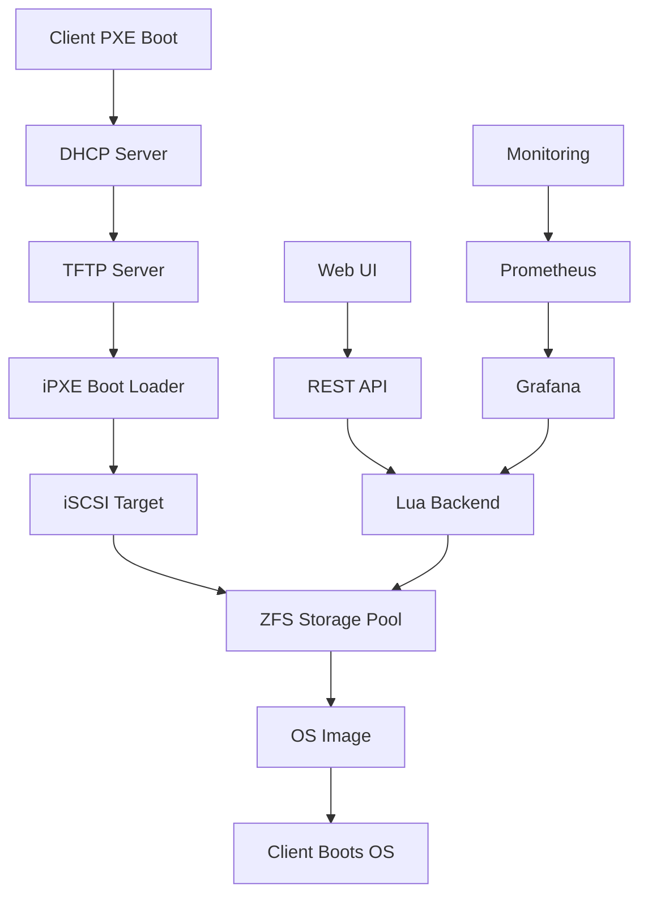

# NSBoot - Modern Diskless Boot System

<div align="center">
  <h3>Free, Open-Source Alternative to CCBoot</h3>
  <p>Diskless boot solution for Internet cafes, schools, and labs</p>
</div>

---

## Overview

NSBoot is a modern, production-ready diskless boot system that enables you to boot multiple workstations from a central server without local hard drives. Built on proven technologies like ZFS, iSCSI, and PXE boot, NSBoot provides:

- **Zero Local Storage**: Boot Windows, Linux, and macOS without hard drives
- **Instant Recovery**: Restart to restore system state automatically
- **Centralized Management**: Modern web UI for managing images and clients
- **High Performance**: ZFS with caching for fast I/O operations
- **Scalable**: Support for 100+ clients with proper hardware

## Key Features

### 🚀 Modern Web Interface
- Responsive Vue.js 3 dashboard with dark mode
- Real-time monitoring and statistics
- Drag-and-drop image uploads
- Mobile-friendly design

### 💾 ZFS Storage
- Advanced filesystem with compression and deduplication
- Snapshot support for instant backups
- L2ARC and ZIL for performance
- Built-in data integrity checking

### 🔒 Enterprise Security
- Optional OAuth2/OIDC authentication
- IPsec encryption for iSCSI traffic
- Rate limiting and DDoS protection
- Comprehensive audit logging

### 📊 Monitoring & Observability
- Prometheus metrics integration
- Pre-built Grafana dashboards
- Real-time alerts for issues
- Performance tracking

### 🐳 Container-Ready
- Docker and Docker Compose support
- Kubernetes Helm charts
- Easy deployment and scaling
- Minimal resource footprint (<500MB)

## Quick Start

```bash
# Clone the repository
git clone https://github.com/vkornilyev1988/NSBoot-.git
cd NSBoot-

# Start with Docker Compose
docker-compose up -d

# Access the web interface
open http://localhost
```

## Architecture



## Use Cases

### Internet Cafes & Gaming Centers
- No hard drives = no unauthorized changes
- Quick system restoration on reboot
- Centralized game library management
- Reduced hardware costs

### Schools & Computer Labs
- Consistent environment across all machines
- Easy software deployment
- Protection against student modifications
- Simplified maintenance

### Enterprise Environments
- Thin client deployments
- Disaster recovery scenarios
- Development/testing environments
- Secure workstations

## System Requirements

### Server
- **CPU**: 4+ cores (8+ recommended for 50+ clients)
- **RAM**: 16GB minimum (32GB+ recommended)
- **Storage**: SSD for ZFS pool (NVMe recommended)
- **Network**: Gigabit Ethernet (10GbE for 100+ clients)
- **OS**: Ubuntu 20.04+ or Debian 11+

### Clients
- **Network Boot**: PXE or UEFI network boot support
- **RAM**: 4GB minimum (depends on OS)
- **Network**: Gigabit Ethernet recommended

## Comparison with Alternatives

| Feature | NSBoot | CCBoot | FOG Project | Tiny PXE |
|---------|--------|--------|-------------|----------|
| License | AGPL-3.0 | Proprietary | GPL-3.0 | GPL-3.0 |
| Web UI | ✅ Modern | ✅ Basic | ✅ Basic | ❌ |
| ZFS Support | ✅ | ❌ | ❌ | ❌ |
| Multi-OS | ✅ | ✅ | ✅ | ✅ |
| Docker | ✅ | ❌ | ⚠️ Limited | ❌ |
| Monitoring | ✅ Prometheus | ❌ | ❌ | ❌ |
| API | ✅ REST | ❌ | ⚠️ Limited | ❌ |
| Cost | Free | $$ | Free | Free |

## Community & Support

- **GitHub**: [Issues & Discussions](https://github.com/vkornilyev1988/NSBoot-/issues)
- **Documentation**: [Full Documentation](https://nsboot.github.io)
- **Docker Hub**: [Official Images](https://hub.docker.com/r/nsboot/nsboot)

## Contributing

We welcome contributions! See our [Contributing Guide](development/contributing.md) for details.

## License

NSBoot is licensed under the [GNU Affero General Public License v3.0](https://www.gnu.org/licenses/agpl-3.0.en.html).

---

<div align="center">
  <p>Made with ❤️ by the NSBoot community</p>
</div>
